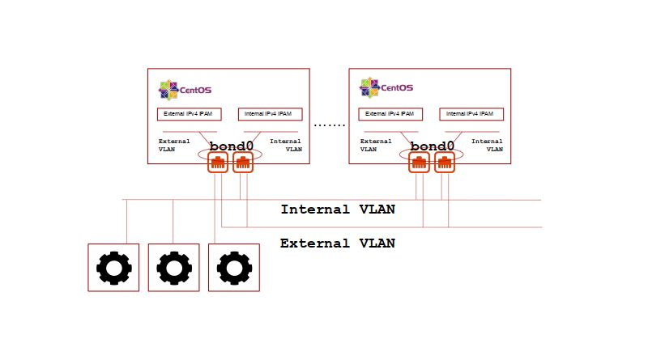

# equinix_metal_terraform_volterra_ce_cluster
Volterra CE Cluster Deployment on Equinix Bare Metal IaaS

This terraform workspace creates an Volterra site on Equinix Metal servers.

Euquinix Metal services provide the necessary services to bootstrap various linux distributions on dedicated servers running in various Equinix facilities around the world. By default, the bootstrapped linux system presents a single LACP bonded network interface with a public routable IP and an private IP which is routable within the specific Equinix facility. The underlying server model, CPU and RAM, are designated by selecting an Equinix *plan*.

Volterra is a distribued application delivery system (ADN) providing Internet SaaS based deployment of workloads to multi-cloud and edge deployed infrastructures through a dedicated global application delivery network.

## Volterra Customer Edge Deployment

Volterra deploys the customer edge of the ADN as either a virtual machine or a dedicated bootable ISO. Volterra also offers hardware bases solutions of their own to ease direct deployments into various high-performance or carrier infrastructures. Though Equinix Metal supports iPXE chained scripting, remote loading of a system bootstrap requires netboot support, which has not been tested for Volterra customer edge distribution. In addition, the various hardware platforms provided by Equinix metal are not certified Volterra hardware platforms.

This terraform workspace boots from the standard Equinix Metal CENTOS 7 distribution and builds out the necessary linux networking and KVM support to boot multiple Volterra CE KVM generic hardware VMs. The installation of various linux kernel modules, system settings, and the various KVM support tools is done via cloudinit utilizing the Equinix metadata service (packet metadata service).

This workspace allows for Equinix Metal *c3.small.x86* and *c3.medium.x86* plan deployments only. The workspace deploys between 3 and 9 Equinix Metal OnDemand servers which will register between 6 to 27 Volterra CE VMs with the Volterra SaaS. The only sizing control required is the selection of the Equinix Metal plan and the server count via terraform variables.

### Meeting Volterra Customer Edge Networking Requirements

Deploying a Volterra CE site cluster requires:

1. An external site local interface which can route to the Internet for Volterra SaaS registration and service provisioning.
2. That all Volterra CE VMs external site local interface be in the same IP subnet and be routable to each other.
3. At least 3 Volterra CE VMs be launched to provide high-availablity at the customer edge.

While Equinix Metal provides each server instance with an Internet routable management interface, there is no way to guarentee that the default public management interfaces for multiple devices are all provisioned from the same public subnet.

Equinix provides reservable public IP CIDR blocks which can be attached to an Equinix Metal instance and static routed to its public management interface. The attachment of the reserved IP to a Equinix Metal instance (the creation of the static route within the Equinix facility) is referred to as an EIP (elastic IP).

In order to support the requirement for all Volterra CE VMs to be on the same logical IP subnet, while maintain the network redudancy provied by the network bonded Equinix Metal deployment, this workspace deploys the Equinix Metal server instances in a hybrid network type.

In order to support the deployment of Volterra CE VMs across redudant Equinix Metal servers for high-availability, unmanaged VLANs will be attached to each Equinix Metal server with full L3 (IPv4) management ocurring on the booted CENTOS system. Volterra CE VMs support the present of a site local external and a site local internal network interface. This workspace will create two Equinix Metal VLANs, one external and the other internal.

Each of the Equinix VLANs will have private (RFC1918) IPv4 address spaces configured via terraform variables. This IPv4 address spaced used for the Volterra CE VMs is managed by distributed IPAM services running on the each Equinux Metal instance. The external and internal VLANs, and the CENTOS managed IPv4 address space, can be extended to workload servers providing customer edge workloads through the Volterra ADN.

The external IPv4 address space on the external VLAN will have 1:1 NAT applied for Internet access via Equinix Metal EIP attachement. The Equinix Metal reserved public network CIDR will be provisioned and attached to the appropriate Equinix Metal server as part of the terraform orchestration. Providing 1:1 EIP attachment to each CE VM provides the greatest connection diversity for the Equinix Metal bonded LACP hash and allows for Volterra TLS or IPSEC connectivity back to the Volterra SaaS.

